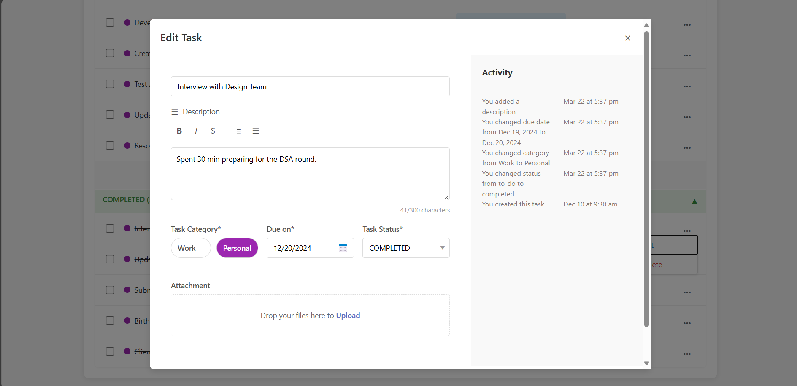

# TaskBuddy - Your Personal Task Management Solution


## Table of Contents
- [TaskBuddy - Your Personal Task Management Solution](#taskbuddy---your-personal-task-management-solution)
  - [Table of Contents](#table-of-contents)
  - [Introduction](#introduction)
  - [Getting Started](#getting-started)
  - [Key Features](#key-features)
    - [User Authentication](#user-authentication)
    - [Task Management](#task-management)
    - [Batch Actions](#batch-actions)
    - [Task History \& Activity Log](#task-history--activity-log)
    - [File Attachments](#file-attachments)
    - [Filter Options](#filter-options)
    - [Board/List View](#boardlist-view)
    - [Responsive Design](#responsive-design)
  - [Technical Implementation](#technical-implementation)
  - [Future Enhancements](#future-enhancements)
  - [Contact \& Support](#contact--support)
    - [How to Run the Project:-](#how-to-run-the-project-)

## Introduction

TaskBuddy is a comprehensive task management application designed to help you organize your personal and professional life with ease. Whether you're managing daily to-dos, tracking project milestones, or collaborating with a team, TaskBuddy provides the tools you need to stay productive and focused.

With its intuitive interface and powerful features, TaskBuddy transforms the way you manage tasks, helping you prioritize effectively and never miss a deadline again.

## Getting Started

1. **Sign Up/Login**: Authenticate your Google Account.
2. **Create Your First Task**: Click the "ADD TASK" button to add a new task
3. **Organize**: Categorize your tasks, set due dates, and attach relevant files
4. **Track Progress**: Move tasks across different status columns as you make progress
5. **Stay Updated**: Monitor task history and activity logs to maintain accountability

## Key Features

### User Authentication

TaskBuddy provides secure and convenient authentication options:

- **Google Sign-In Integration**: Quickly access your account using your existing Google credentials


### Task Management

Comprehensive task management capabilities to handle all your productivity needs:

- **Create & Edit Tasks**: Add detailed task descriptions, set priorities, and update as needed
- **Task Categorization**: Organize tasks by categories (Work, Personal, etc.) for better structure
- **Custom Tagging**: Create and assign tags to tasks for flexible organization
- **Due Date Management**: Set and track deadlines with visual indicators for approaching dates
- **Drag-and-Drop Interface**: Easily rearrange tasks within lists or across status columns


### Batch Actions

Efficiently manage multiple tasks at once:

- **Multi-Select**: Choose multiple tasks for batch operations
- **Bulk Delete**: Remove several tasks simultaneously
- **Status Updates**: Change the status of multiple tasks at once
- **Category Assignment**: Assign or change categories for multiple tasks
- **Tag Management**: Add or remove tags from multiple tasks in one operation
- 

### Task History & Activity Log

Maintain accountability with comprehensive tracking:

- **Change Tracking**: Automatic logging of all task modifications
- **Activity Timeline**: Chronological display of all actions taken on a task
- **User Attribution**: Clear indication of who made each change
- **Status Transitions**: Track how tasks move through different stages
- **Creation & Completion Records**: Log when tasks are created and completed



### File Attachments

Enhance tasks with relevant documents and files:

- **Drag-and-Drop Upload**: Easily attach files to tasks
- **Multiple File Support**: Attach several files to a single task
- **File Preview**: View attached documents without downloading
- **File Management**: Add, remove, or replace attachments as needed
- **Activity Logging**: Automatic tracking of file uploads in the activity log

### Filter Options

Find exactly what you need with powerful filtering capabilities:


- **Date Range Selection**: Find tasks due within specific time periods
- **Status Filtering**: Focus on tasks with particular statuses (To-Do, In Progress, Completed)
- **Search Functionality**: Quickly locate tasks by searching titles and descriptions
- **Combined Filters**: Apply multiple filters simultaneously for precise results
  

### Board/List View

Visualize your tasks in the way that works best for you:

- **Kanban Board View**: Visualize task progress across customizable columns
- **List View**: See all tasks in a compact, sortable list format
- **Toggle Between Views**: Easily switch between board and list views with a single click
- **Persistent Preferences**: TaskBuddy remembers your preferred view
- **Status Columns**: Organize tasks by status (To-Do, In Progress, Completed)
- **Visual Indicators**: Color-coding and icons to quickly identify task properties


### Responsive Design

Access TaskBuddy from any device with a seamless experience:

- **Mobile-First Approach**: Optimized for smartphones and tablets
- **Desktop Enhancement**: Full-featured experience on larger screens
- **Adaptive Layout**: Interface elements adjust based on screen size
- **Touch-Friendly Controls**: Easy to use on touchscreen devices
- **Consistent Experience**: Core functionality available across all devices
- **Offline Capabilities**: Basic functionality when internet connection is limited

## Technical Implementation

TaskBuddy is built using modern web technologies:

- **Frontend**: React.js with hooks for state management
- **Authentication**: Firebase Authentication
- **Styling**: CSS with responsive design principles
- **Drag-and-Drop**: React DnD library
- **File Handling**: Secure file upload and storage

## Future Enhancements

We're constantly improving TaskBuddy with new features:

- **Team Collaboration**: Share tasks and collaborate with team members
- **Calendar Integration**: Sync with Google Calendar and other providers
- **Recurring Tasks**: Set up repeating tasks on custom schedules
- **Advanced Analytics**: Gain insights into your productivity patterns
- **API Integration**: Connect with other productivity tools
- **Mobile Apps**: Native applications for iOS and Android.
- **FireStore Database**: Storing Tasks on cloud. 

## Contact & Support

Need help or have suggestions? We're here for you:

More similar projects by me - https://surbhi-portfolio-beige.vercel.app/


### How to Run the Project:-

Clone the repository here:
```
>>> git clone https://github.com/Surbhi-sinha/Task-Buddy.git
```

Install Npm dependencies
```sh
>>> npm i
```

Start the project.
```sh
>>> npm start
```